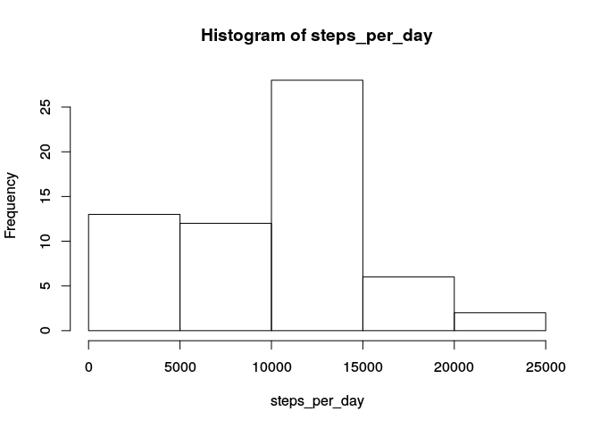
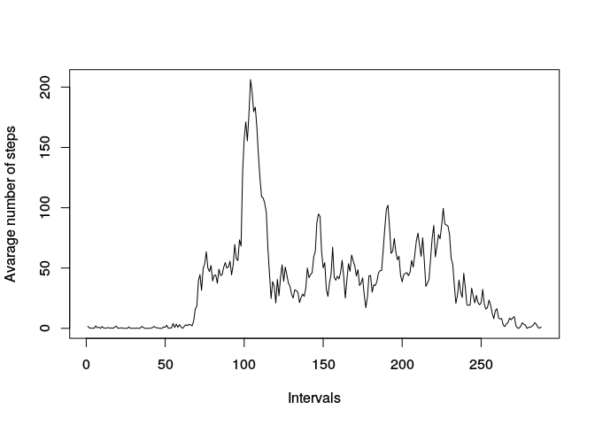
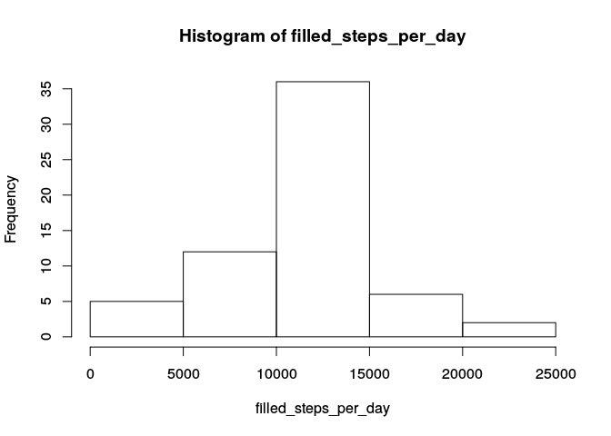

# Reproducible Research: Peer Assessment 1


# Loading and preprocessing the data


```r
unzip("activity.zip")
activity_data <- read.csv("activity.csv")
summary(activity_data)
```

```
##      steps                date          interval     
##  Min.   :  0.00   2012-10-01:  288   Min.   :   0.0  
##  1st Qu.:  0.00   2012-10-02:  288   1st Qu.: 588.8  
##  Median :  0.00   2012-10-03:  288   Median :1177.5  
##  Mean   : 37.38   2012-10-04:  288   Mean   :1177.5  
##  3rd Qu.: 12.00   2012-10-05:  288   3rd Qu.:1766.2  
##  Max.   :806.00   2012-10-06:  288   Max.   :2355.0  
##  NA's   :2304     (Other)   :15840
```

# What is the mean total number of steps taken per day?

### Calculating the total number of steps taken per day


```r
steps_per_day <- tapply(activity_data$steps, activity_data$date, FUN = sum, na.rm=TRUE)
```

### Histogramm of the total number of steps taken each day


```r
hist(steps_per_day)
```

<!-- -->

### Calculating the mean and median of the total number of steps taken per day


```r
mean(steps_per_day)
```

```
## [1] 9354.23
```

```r
median(steps_per_day)
```

```
## [1] 10395
```

# What is the average daily activity pattern?

### Time series plot of the 5-minute interval and the average number of steps taken, averaged across all days 


```r
avg_steps_per_interval <- tapply(activity_data$steps, activity_data$interval, FUN = mean, na.rm=TRUE)
plot(avg_steps_per_interval, type = "l", xlab = "Intervals", ylab = "Avarage number of steps")
```

<!-- -->

### Which 5-minute interval, on average across all the days in the dataset, contains the maximum number of steps?

```r
max_index <- which.max(avg_steps_per_interval)
avg_steps_per_interval[max_index]
```

```
##      835 
## 206.1698
```

# Imputing missing values

### Total number of missing values in the dataset

```r
summary(is.na(activity_data))
```

```
##    steps            date          interval      
##  Mode :logical   Mode :logical   Mode :logical  
##  FALSE:15264     FALSE:17568     FALSE:17568    
##  TRUE :2304      NA's :0         NA's :0        
##  NA's :0
```

```r
sum(is.na(activity_data$steps))
```

```
## [1] 2304
```

### Filling in missing values in the dataset

```r
filled_activity <- data.frame(activity_data)
filled_activity$steps <- ifelse(is.na(filled_activity$steps), avg_steps_per_interval[as.character(filled_activity$interval)], filled_activity$steps)
```

### Histogram of the total number of steps taken each day after filling in the missing data.

```r
filled_steps_per_day <- tapply(filled_activity$steps, filled_activity$date, FUN = sum)
hist(filled_steps_per_day)
```

<!-- -->

### Mean and median total number of steps taken per day after filling in the missing data.

```r
mean(filled_steps_per_day)
```

```
## [1] 10766.19
```

```r
median(filled_steps_per_day)
```

```
## [1] 10766.19
```

# Are there differences in activity patterns between weekdays and weekends?
